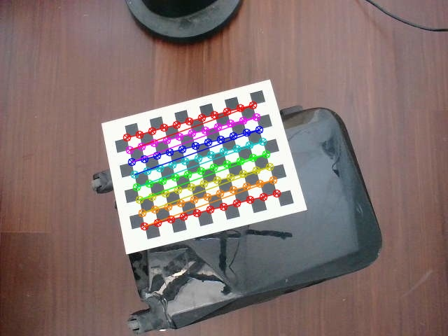
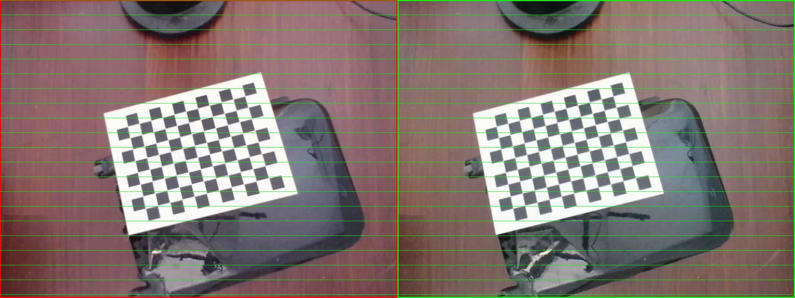
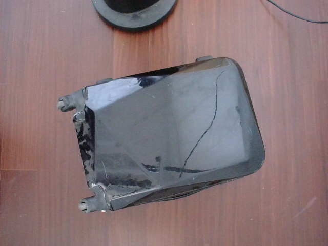
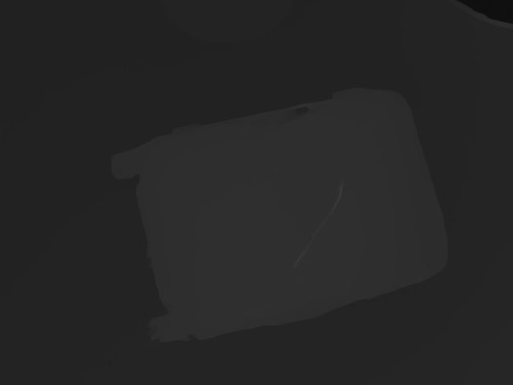

# StereoAlgorithms
简体中文 | [English](./RAFTStereoAlgorithm_en.md)

如果觉得有用，不妨给个Star⭐️🌟支持一下吧~ 谢谢！

# Acknowledgments & Contact 

### 1.WeChat ID: cbp931126
加微信(备注：StereoAlgorithm),拉你进群

### 2.QQ Group：517671804

# Stereo_Calibration(双目相机标定)
## 使用方法
1. (可选)首先使用process_image.py脚本将图像(1280,480)的图像裁剪，裁剪后的左右图像(640,480)保存在left_right_image文件夹下
2. left_right_image文件夹下的left*.jpg,right*.jpg图像名称写入stereo_calib.xml中，保证left,right顺序填写;
3. 在更改你的棋盘格参数:1)纵向内角点数;2)横向内角点数, 3)棋盘格大小(mm),4)是否显示标定过程中的的图像
   ```
   numCornersHor = 8;                                          //水平方向棋盘格内角点个数
   numCornersVer =11;                                          //垂直方向棋盘格内角点个数
   numSquares =25;                                             //棋盘格宽高(这里默认是方格)
   rectifyImageSavePath = "Stereo_Calibration/rectifyImage"    //标定校正为完成后左右图像存放的路径
   imagelistfn="stereo_calib.xml"                              //待标定的左右图像路径
   ```
4. 标定模块单独编译运行
   ```
   cd Stereo_Calibration
   mkdir build&&cd build
   cmake ..&&make -j8
   ./Stereo_Calibration
   ```
5. 在标定的过程中会显示左右图像的角点以及左右图像校正后拼接在一起的图像,可根据拼接后图像的绿色线来初步判断标定校正过程是否正确
   
   
    
6. 最终在根目录下生成StereoCalibration.yml的标定文件

### 注意
1.  在标定显示的过程中，可以将角点检测有偏差的图像(一般是远处的角点比较小的)去除后重新标定


# RAFTStereo
## 1.pth导出到onnx
1. 下载 [RAFT-Stereo](https://github.com/princeton-vl/RAFT-Stereo/tree/main)
2. 因为F.grid_sample op直到onnx 16才支持，这里转换为mmcv的bilinear_grid_sample的op
   
   1)需要安装mmcv;
   
   2)F.grid_sample替换为bilinear_grid_sample;
3. 导出onnx模型
   
   1） 导出sceneflow模型
   ```
   （1）python3 export_onnx.py --restore_ckpt models/raftstereo-sceneflow.pth
   （2）onnxsim raftstereo-sceneflow_480_640.onnx raftstereo-sceneflow_480_640_sim.onnx
   （3）(option)polygraphy surgeon sanitize --fold-constants raftstereo-sceneflow_480_640_sim.onnx -o raftstereo-sceneflow_480_640_sim_ploy.onnx
   ```
   2）导出realtime模型
   ```
   （1）python3 export_onnx.py --restore_ckpt models/raftstereo-realtime.pth --shared_backbone --n_downsample 3 --n_gru_layers 2 --slow_fast_gru --valid_iters 7 --mixed_precision
   
   （2）onnxsim raftstereo-realtime_480_640.onnx raftstereo-realtime_480_640_sim.onnx

   （3）(option)polygraphy surgeon sanitize --fold-constants raftstereo-realtime_480_640_sim.onnx -o raftstereo-realtime_480_640_sim_ploy.onnx
   ```

## 2.使用导出的onnx模型或者下载已经转好的onnx模型
### 1.模型下载
([Baidu Drive](链接: https://pan.baidu.com/s/1tgeqPmjPeKmCDQ2NGJZMWQ code: hdiv))

### 2.参数设置(最好写绝对路径或者将需要的文件拷贝到build目录下)
```
   //双目相机标定文件
   char* stereo_calibration_path="StereoCalibration.yml";
   //onnx模型路径，自动将onnx模型转为engine模型
   char* strero_engine_path="raftstereo-sceneflow_480_640_poly.onnx"; 
   //相机采集的左图像
   cv::Mat imageL=cv::imread("left0.jpg");
   //相机采集的右图像
   cv::Mat imageR=cv::imread("right0.jpg");
```
### 3.RAFTStereo模块编译运行(其确保已经将step2中需要的文件拷贝到build文件夹下)
   ```
   cd RAFTStereo
   mkdir build&&cd build
   cmake ..&&make -j8
   ./raft_stereo_demo
   ```
### 4.运行结果
   1. 会在运行目录下保存视差图(disparity.jpg)
   2. 会在运行目录下保存点云文件，每一行分别是x,y,z坐标(pointcloud.txt)
   3. 可以修改cuda代码将左图像和点云对齐，输出x,y,z,r,g,b格式的数据
   
    
    
### 5.模型说明
| 模型 |  说明   |  备注 |
|:----------:|:----------:|:----------|
|raftstereo-sceneflow_480_640_poly.onnx   |sceneflow双目深度估计模型| ([Baidu Drive](链接: https://pan.baidu.com/s/1tgeqPmjPeKmCDQ2NGJZMWQ code: hdiv)) |     
|raftstereo-realtime_480_640_ploy.onnx	   |realtime双目深度估计模型| 可自行下载模型进行转化|   

### 6.其他
  平台|  sceneflow(640*480)耗时  |realtime(640*480)耗时|说明|
|:----------:|:----------:|:----------:|:----------:|
|3090|38ms| 11ms ||   
|3060|83ms|24ms| ||
|jetson Xavier-NX||120ms|sceneflow未尝试|
|jetson TX2-NX||400ms|sceneflow未尝试|
|jetson Nano|||支持|

# CREStereo(to do)

# DistDepth(to do)

# Hitnet(to do)

# RealtimeStereo(to do)


# 使用方法
        

## 2.环境
1. ubuntu20.04+cuda11.1+cudnn8.2.1+TrnsorRT8.2.5.1(测试通过)
2. ubuntu18.04+cuda10.2+cudnn8.2.1+TrnsorRT8.2.5.1(测试通过)
3. nano,TX2,TX2-NX,Xavier-NX                       (测试通过)
4. 其他环境请自行尝试或者加群了解


## 3.编译

1. 更改根目录下的CMakeLists.txt,设置tensorrt的安装目录
```
set(TensorRT_INCLUDE "/xxx/xxx/TensorRT-8.2.5.1/include" CACHE INTERNAL "TensorRT Library include location")
set(TensorRT_LIB "/xxx/xxx/TensorRT-8.2.5.1/lib" CACHE INTERNAL "TensorRT Library lib location")
```
2. 默认opencv已安装，cuda,cudnn已安装
3. 为了Debug默认编译 ```-g O0``` 版本,如果为了加快速度请编译Release版本

4. 使用Visual Studio Code快捷键编译(4,5二选其一):
```
   ctrl+shift+B
```
5. 使用命令行编译(4,5二选其一):
```
   mkdir build
   cd build
   cmake ..
   make -j6
```
 

# References
1. https://github.com/princeton-vl/RAFT-Stereo
2. https://github.com/nburrus/RAFT-Stereo


