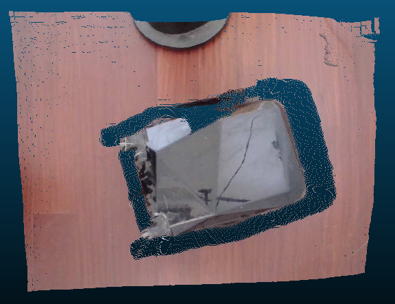
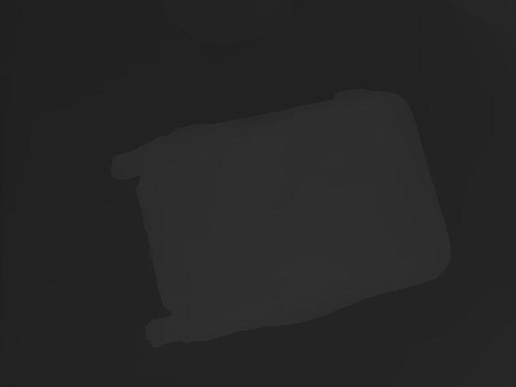
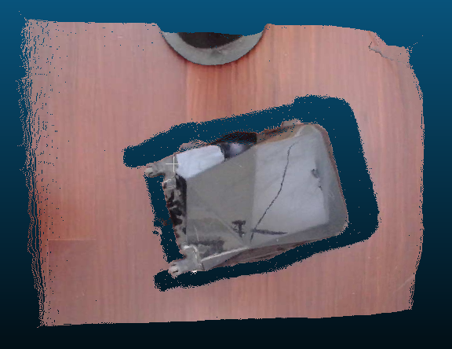
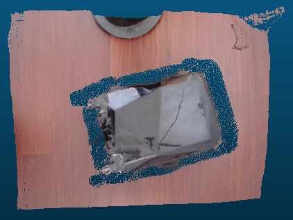
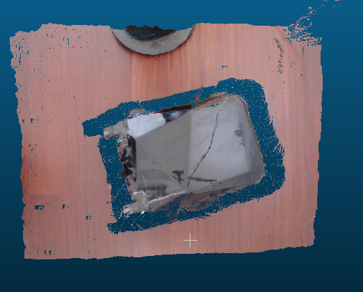

English|[简体中文](./README.md)

If you find it useful, you may wish to give a Star⭐️🌟support~ Thank you!

# Acknowledgments & Contact 

### 1.WeChat ID: cbp931126
Add me WeChat(Note: StereoAlgorithm) to pull you into the group

### 2.QQ Group：517671804


# Requirements
1. ubuntu20.04+cuda11.1+cudnn8.2.1+TensorRT8.2.5.1 (test pass)
2. ubuntu20.04+cuda11.1+cudnn8.2.1+TensorRT8.6.1.6 (FastACVNet_plus requied TrnsorRT8.6.1.6)
3. ubuntu18.04+cuda10.2+cudnn8.2.1+TensorRT8.2.5.1 (test pass)
4. nano,TX2,TX2-NX,Xavier-NX                       (test pass)
5. For other environments, please try it yourself or join a group to understand

# Start

1. Change the CMakeLists .txt in the root directory and set the directory where tensorrt is installed
```
set(TensorRT_INCLUDE "/xxx/xxx/TensorRT-8.2.5.1/include" CACHE INTERNAL "TensorRT Library include location")
set(TensorRT_LIB "/xxx/xxx/TensorRT-8.2.5.1/lib" CACHE INTERNAL "TensorRT Library lib location")
```
2. By default, OpenCV is installed, CUDA, CUDNN are installed
3. In order to debug the ```-g O0``` version is compiled by default, if you want to speed things up, compile the release version

4. Compile using Visual Studio Code shortcuts (choose one of 4,5):
```
   ctrl+shift+B
```
5. Compile using the command line (choose one of 4,5):
```
   mkdir build
   cd build
   cmake ..
   make -j6
```
6. If you use vscode to debug a single module, change the corresponding "program" in launch.json


# Stereo Algorithm&&Calibration
## Stereo_Calibration
### 1.How to use
1. (optionally)First use the process_image.py script to crop the image of the image (1280,480), and save the cropped left and right images (640,480) under the left_right_image folder;
2.  Write the image name .jpg left*.jpg and right* under the left_right_image folder stereo_calib.xml to ensure that left and right are filled in order;
3. Change your checkerboard parameters: 1) the number of longitudinal inside corner points; 2) the number of transverse inner corner points, 3) checkerboard size (mm), 4) whether to display the image during the calibration process
   ```
   numCornersHor = 8;                                          //The number of corner points inside the horizontal checkerboard
   numCornersVer =11;                                          //The number of corner points inside the vertical checkerboard
   numSquares =25;                                             //Checkerboard width and height (here the default is the square)
   rectifyImageSavePath = "Stereo_Calibration/rectifyImage"    //The calibration is corrected to the path where the left and right images are stored after completion
   imagelistfn="stereo_calib.xml"                              //The left and right image paths to calibrate
   ```
4. The calibration module is compiled and run separately
   ```
   cd Stereo_Calibration
   mkdir build&&cd build
   cmake ..&&make -j8
   ./Stereo_Calibration
   ```
5. In the process of calibration, the corner points of the left and right images and the images stitched together after the correction of the left and right images will be displayed, and whether the calibration correction process is correct can be preliminarily judged according to the green line of the stitched image
   
   
    
6. Finally, the calibration file of StereoCalibration.yml is generated in the root directory

### 2.Note!!!
1.  In the process of calibrating the display, the image with deviation in corner detection (usually the corner point in the distance is relatively small) can be removed and recalibrated


## 2. RAFTStereo
### 1.3D reconstruction effect
    

### 2.pth export to ONNX
1. Download [RAFT-Stereo](https://github.com/princeton-vl/RAFT-Stereo/tree/main)
2. Because F.grid_sample op was not supported until ONNX 16, here it is converted to MMCV's bilinear_grid_sample op
   
   1)MMCV needs to be installed;
   
   2)F.grid_sample replaced with bilinear_grid_sample;
3. Export the ONNX model
   
   1） Export the sceneflow model
   ```
   （1）python3 export_onnx.py --restore_ckpt models/raftstereo-sceneflow.pth
   （2）onnxsim raftstereo-sceneflow_480_640.onnx raftstereo-sceneflow_480_640_sim.onnx
   （3）(option)polygraphy surgeon sanitize --fold-constants raftstereo-sceneflow_480_640_sim.onnx -o raftstereo-sceneflow_480_640_sim_ploy.onnx
   ```
   2） Export the realtime model
   ```
   （1）python3 export_onnx.py --restore_ckpt models/raftstereo-realtime.pth --shared_backbone --n_downsample 3 --n_gru_layers 2 --slow_fast_gru --valid_iters 7 --mixed_precision
   
   （2）onnxsim raftstereo-realtime_480_640.onnx raftstereo-realtime_480_640_sim.onnx

   （3）(option)polygraphy surgeon sanitize --fold-constants raftstereo-realtime_480_640_sim.onnx -o raftstereo-realtime_480_640_sim_ploy.onnx
   ```

### 3.Use the exported ONNX model or download the exported ONNX model
#### 1.Model download
([Baidu Drive](https://pan.baidu.com/s/1tgeqPmjPeKmCDQ2NGJZMWQ code: hdiv))

#### 2.Parameter settings (preferably write absolute paths or copy the required files to the /build/RAFTStereo/test folder)
```
   //Binocular camera calibration file
   char* stereo_calibration_path="StereoCalibration.yml";
   //ONNX model path, automatically convert ONNX model to engine model
   char* strero_engine_path="raftstereo-sceneflow_480_640_poly.onnx"; 
   //The left image captured by the camera
   cv::Mat imageL=cv::imread("left0.jpg");
   //Right image captured by the camera
   cv::Mat imageR=cv::imread("right0.jpg");
```
#### 4.Compile and run (make sure that the files needed in step 2 have been copied to the build folder)
   ```
   cd StereoAlgorithms
   mkdir build&&cd build
   cmake ..&&make -j8
   ./build/RAFTStereo/test/raft_stereo_demo
   ```
#### 5.Run the results
   1. The disparity.jpg will be saved in the running directory
   2. The pointcloud .txt file is saved in the running directory, and each line is represented as x, y, z, r, g, b
   
    
   
    
#### 6.Model description
| model |  description   |  note |
|:----------:|:----------:|:----------|
|raftstereo-sceneflow_480_640_poly.onnx   |sceneflowBinocular depth estimation model| ([Baidu Drive](https://pan.baidu.com/s/1tgeqPmjPeKmCDQ2NGJZMWQ code: hdiv)) |     
|raftstereo-realtime_480_640_ploy.onnx	   |realtimeBinocular depth estimation model| You can download the model yourself to convert|   

#### 7.Additional
  platform|  sceneflow(640*480)Consume time  |realtime(640*480)Consume time|description|
|:----------:|:----------:|:----------:|:----------:|
|3090|38ms| 11ms ||   
|3060|83ms|24ms| ||
|jetson Xavier-NX||120ms|sceneflow Not tested|
|jetson TX2-NX||400ms|sceneflow Not tested|
|jetson Nano|||support|

#### References
1. https://github.com/princeton-vl/RAFT-Stereo
2. https://github.com/nburrus/RAFT-Stereo


## 3. HitNet
### 1.3D reconstruction effect
#### 1.Stereo depth estimation
   
   
   Stereo depth estimation on the cones images from the Middlebury dataset (https://vision.middlebury.edu/stereo/data/scenes2003/)
#### 2.onnxHitnetDepthEstimation
   

### 2.Use the exported ONNX model or download the exported ONNX model
#### 1.Model download
([Baidu Drive](https://pan.baidu.com/s/1R3KU-pGJUJvGVOg8MPg8Nw code: 6stm))

#### 2.Parameter settings (preferably write absolute paths or copy the required files to the /build/RAFTStereo/test folder)
```
   //Binocular camera calibration file
   char* stereo_calibration_path="StereoCalibration.yml";
   //ONNX model path, automatically convert ONNX model to engine model
   char* strero_engine_path="model_float32.onnx"; 
   //The left image captured by the camera
   cv::Mat imageL=cv::imread("left0.jpg");
   //Right image captured by the camera
   cv::Mat imageR=cv::imread("right0.jpg");
```
#### 3.Compile and run (make sure that the files needed in step 2 have been copied to the build folder)
   ```
   cd StereoAlgorithms
   mkdir build&&cd build
   cmake ..&&make -j8
   ./build/HitNet/test/HitNet_demo
   ```
#### 4.Run the results
   1. The disparity.jpg will be saved in the running directory
   2. The pointcloud .txt file is saved in the running directory, and each line is represented as x, y, z, r, g, b
   
    
   
    
#### 5.Run the results
  platform|  middlebury_d400(640*480)Consume time  |flyingthings_finalpass_xl(640*480)Consume time|description|
|:----------:|:----------:|:----------:|:----------:|
|3090|15ms|||   
|3060|||Not tested|
|jetson Xavier-NX|||Not tested|
|jetson TX2-NX|||Not tested|
|jetson Nano|||Not tested|

#### 6.References
1. https://github.com/PINTO0309/PINTO_model_zoo/tree/main/142_HITNET
2. https://github.com/iwatake2222/play_with_tensorrt/tree/master/pj_tensorrt_depth_stereo_hitnet
3. https://github.com/ibaiGorordo/ONNX-HITNET-Stereo-Depth-estimation

## 4. CREStereo
### 1.3D reconstruction effect
#### 1.Stereo depth estimation
   

#### 2.left_image,right_image,heat_map
    

### 2.Use the exported ONNX model or download the exported ONNX model
#### 1.Download
([Baidu Drive](https://pan.baidu.com/s/1lGL8FOjcy6c1y5oDJLYA4w code:gimg))

#### 2.Parameter settings (preferably write absolute paths or copy the required files to the /build/RAFTStereo/test folder)
```
   //Binocular camera calibration file
   char* stereo_calibration_path="StereoCalibration.yml";
   //ONNX model path, automatically convert ONNX model to engine model
   char* strero_engine_path="crestereo_init_iter10_480x640.onnx"; 
   //The left image captured by the camera
   cv::Mat imageL=cv::imread("left0.jpg");
   //Right image captured by the camera
   cv::Mat imageR=cv::imread("right0.jpg");
```
#### 3.Compile and run (make sure that the files needed in step 2 have been copied to the build folder)
   ```
   cd StereoAlgorithms
   mkdir build&&cd build
   cmake ..&&make -j8
   ./build/CREStereo/test/crestereo_demo
   ```
#### 4.Run the results
   1. The disparity.jpg will be saved in the running directory
   2. The pointcloud .txt file is saved in the running directory, and each line is represented as x, y, z, r, g, b
   3. The heatmap .jpg heatmap will be saved in the running directory;
   
    
   
    
#### 5.Additional
  platform|iter2_480x640|iter5_480x640|iter10_480x640|description|
|:----------:|:----------:|:----------:|:----------:|:----------:|
|3090|12ms|23ms|42ms||   
|3060||||Not tested|
|jetson Xavier-NX||||Not tested|
|jetson TX2-NX||||Not tested|
|jetson Nano||||Not tested|

#### 6.References
1. https://github.com/megvii-research/CREStereo
2. https://github.com/ibaiGorordo/ONNX-CREStereo-Depth-Estimation
3. https://github.com/PINTO0309/PINTO_model_zoo/tree/main/284_CREStereo

## 5.FastACVNet_plus(Only TensorRT8.6+ is supported!!)
### 1.3D reconstruction effect
#### 1.Demo on KITTI raw data
   

#### 2.Qualitative results on Scene Flow
    

### 2.Use the exported ONNX model or download the exported ONNX model
#### 1.Download
([Baidu Drive](https://pan.baidu.com/s/1kxrNLlAFgpTwECF21SM9_g code:83qn))

#### 2..Parameter settings (preferably write absolute paths or copy the required files to the /build/RAFTStereo/test folder)
```
   char* stereo_calibration_path="StereoCalibration.yml";
   char* strero_engine_path="fast_acvnet_plus_generalization_opset16_480x640.onnx"; 
   cv::Mat imageL=cv::imread("left0.jpg");
   cv::Mat imageR=cv::imread("right0.jpg");
```
#### 3.Compile and run (make sure that the files needed in step 2 have been copied to the build folder)
   Root add: add_subdirectory("FastACVNet_plus")
   ```
   cd StereoAlgorithms
   mkdir build&&cd build
   cmake ..&&make -j8
   ./build/FastACVNet_plus/test/fastacvnet_plus_demo
   ```
#### 4.Run the results
   1. The disparity.jpg will be saved in the running directory
   2. The pointcloud .txt file is saved in the running directory, and each line is represented as x, y, z, r, g, b
   3. The heatmap .jpg heatmap will be saved in the running directory;
   
    
   
    
#### 6.Additional
  platform|generalization_opset16_480x640|description|
|:----------:|:----------:|:----------:|
|3090|12ms||   
|3060||Not tested|
|jetson Xavier-NX||Not tested|
|jetson TX2-NX||Not tested|
|jetson Nano||Not tested|

#### References
1. https://github.com/gangweiX/Fast-ACVNet
2. https://github.com/ibaiGorordo/ONNX-FastACVNet-Depth-Estimation/tree/main
3. https://github.com/ibaiGorordo/ONNX-ACVNet-Stereo-Depth-Estimation
4. https://github.com/PINTO0309/PINTO_model_zoo/tree/main/338_Fast-ACVNet

## 6. Distepth(to do)
## 7. RealtimeStereo(to do)


